# Evolutionary computation - Greedy heuristics
- Zuzanna Gawrysiak 148255
- Agata Żywot 148258

## Problem description
We are given three columns of integers with a row for each node. The first two columns contain x and y coordinates of the node positions in a plane. The third column contains node costs. The goal is to select ceil(0.5 * nodes)  and form a Hamiltonian cycle through this set of nodes such that the
sum of the total length of the path plus the total cost of the selected nodes is minimized.

The distances between nodes are calculated as Euclidean distances rounded mathematically to integer values. The distance matrix should be calculated just after reading an instance and then only the distance matrix (no nodes coordinates) should be accessed by optimization methods to allow
instances defined only by distance matrices.

## Methods implemented 
### Random solution:
```
function random_solution(nodes_number, start_node, distance_matrix)
    k = round(nodes_number / 2 - 1)
    permutation = randomly permute the numbers from 1 to N and select the first k numbers

    if start_node is in permutation:
        while length of permutation is not equal to ceil(nodes_number / 2):
            r = randomly select an integer between 1 and N
            if r is not in permutation:
                add r to the end of permutation
    else:
        add start_node to the beginning of permutation

    return permutation
end
```
### Nearest neighbor:
```
function nn_solution(nodes_number, start_node, distance_matrix)
    Initialize a solution list with start_node as its only element

    while length of the solution list is not equal to ceil(nodes_number / 2):
        min_index = index of the minimum value in the row of the last node in the solution list in the distance_matrix
        Set the distance_matrix value at solution[last element] and min_index to a very large value (e.g., 1000000)
        Set all values in the min_index column of the distance_matrix to a very large value
        Add min_index to the end of the solution list

    Return the solution list
end

```
### Greedy cycle:
```
function greedy_cycle(nodes_number, start_node, distance_matrix, cost_vector)

    current_node = start_node
    Initialize a solution list with start_node as its only element

    while length of the solution list is not equal to ceil(nodes_number / 2):

        # Mark the current node as visited by setting its distance and cost to infinity
        Set all values in the current_node column of the distance_matrix to inf
        Set cost_vector[current_node] to inf

        distances = the row of the current_node in the distance_matrix
        costs = cost_vector
        summed = distances + costs

        new_node = index of the minimum value in the summed array
        
        Add new_node to the end of the solution list
        current_node = new_node

    Return the solution list
end

```

## Results
Statistics for the cost function and the best solution for each method. 
### Random solution
| Problem instance | min         | max         | mean        | 
| -----------      | ----------- | ----------- | ----------- |
| TSPA             | 238699.0    | 293349.0    | 264329.765  |
| TSPB             | 235387.0    | 291856.0    | 266305.02   |
| TSPC             | 193798.0    | 241475.0    | 215958.905  |
| TSPD             | 190680.0    | 244677.0    | 219239.095  |


| | |
|:-------------------------:|:-------------------------:|
|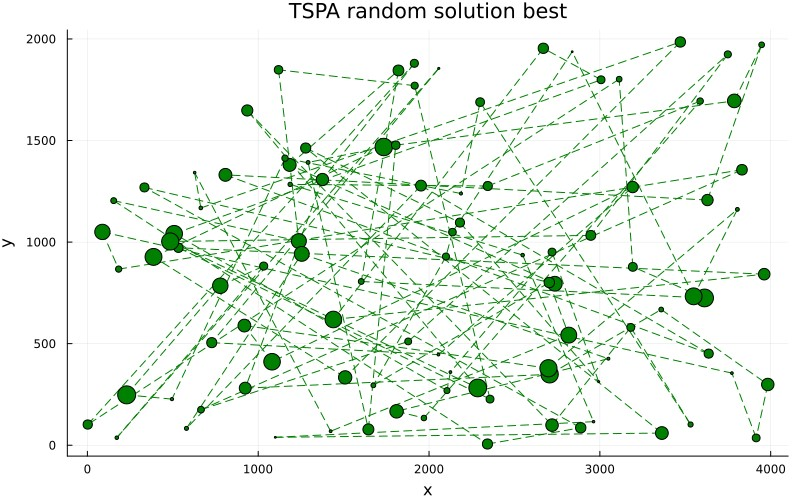| 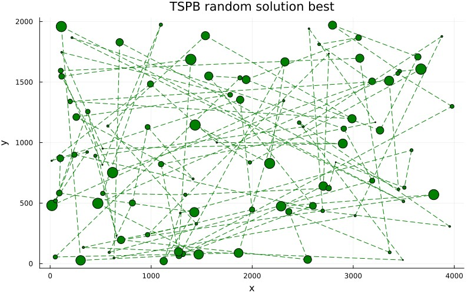|
|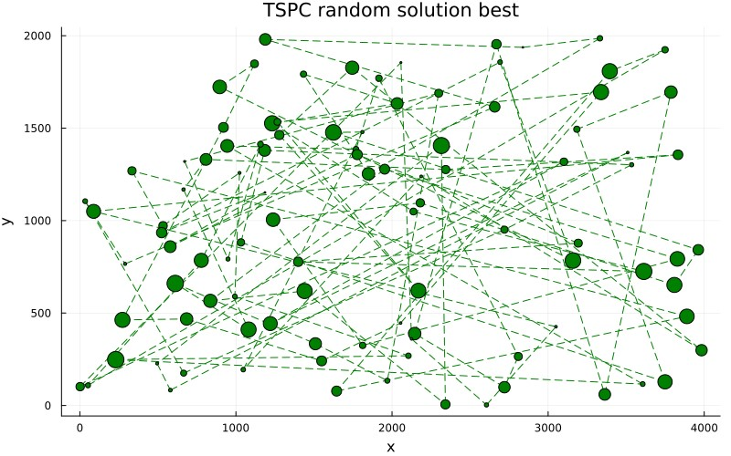| 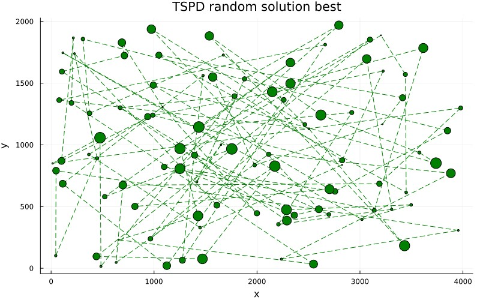|

### Nearest neighbor
| Problem instance | min         | max         | mean        | 
| -----------      | ----------- | ----------- | ----------- |
| TSPA             | 110035.0    | 125805.0    | 116516.55   |
| TSPB             | 109047.0    | 124759.0    | 116413.93   |
| TSPC             | 62629.0     | 71814.0     | 66329.945   |
| TSPD             | 62967.0     | 71396.0     | 67119.2     |


| | |
|:-------------------------:|:-------------------------:|
|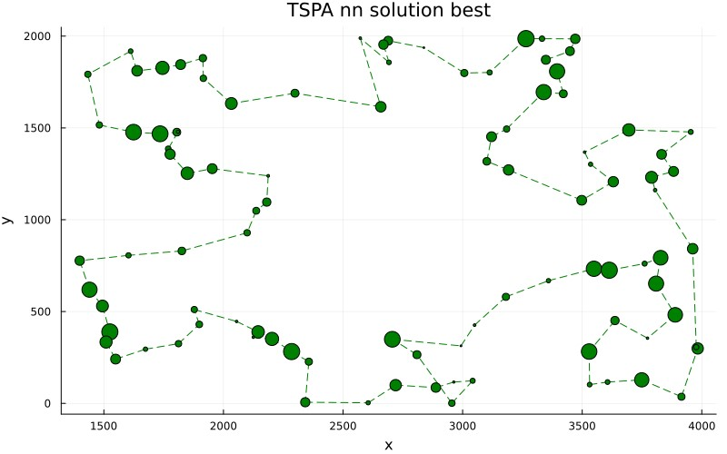| 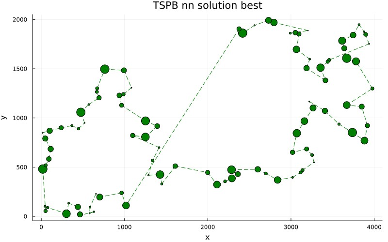|
|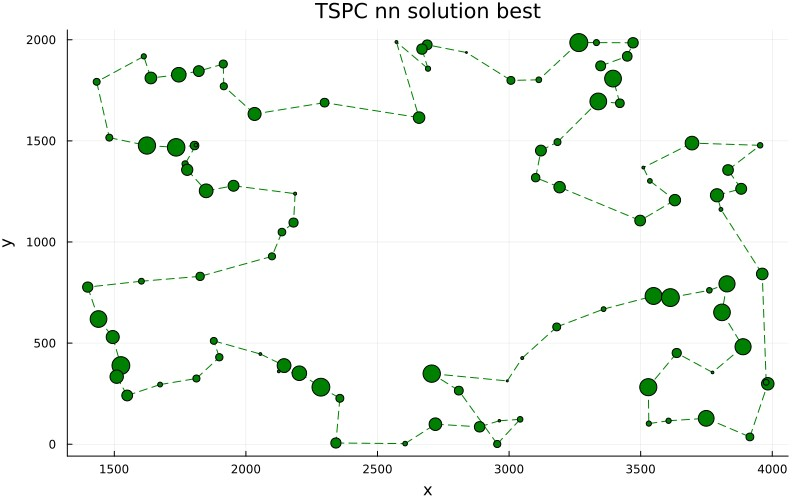| |


### Greedy cycle
| Problem instance | min         | max         | mean        | 
| -----------      | ----------- | ----------- | ----------- |
| TSPA             | 84471.0     | 95013.0     | 87679.135   |
| TSPB             | 77448.0     | 82631.0     | 79282.58    |
| TSPC             | 56304.0     | 63697.0     | 58872.68    |
| TSPD             | 50335.0     | 59846.0     | 54290.68    |


| | |
|:-------------------------:|:-------------------------:|
|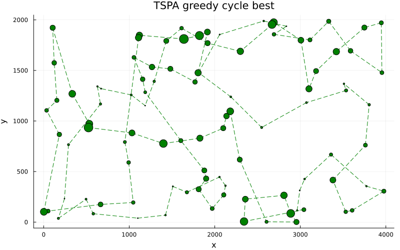||
|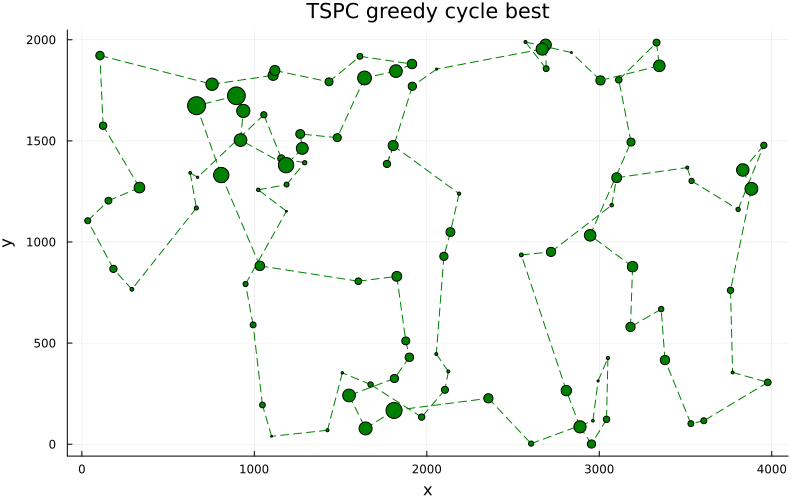|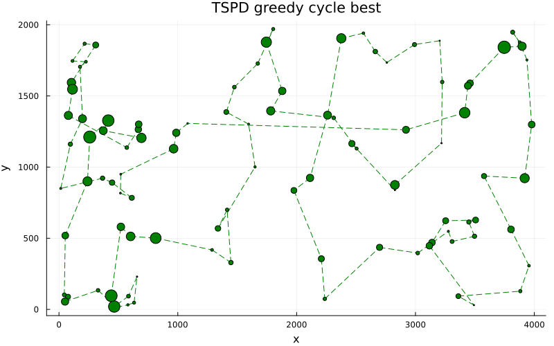|


## Comparison
### Visualizations
|Problem instance| Random solution | Nearest neighbor | Greedy cycle |
|----------------|-----------------|------------------|--------------|
| TSPA | 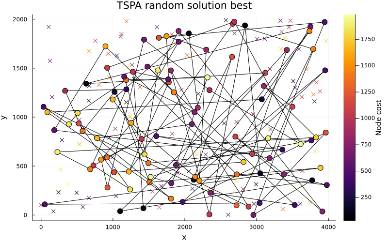||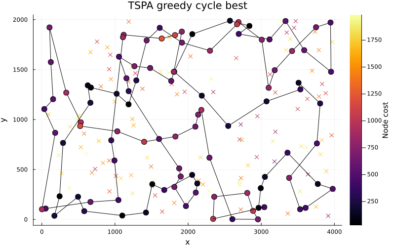|
| TSPB | |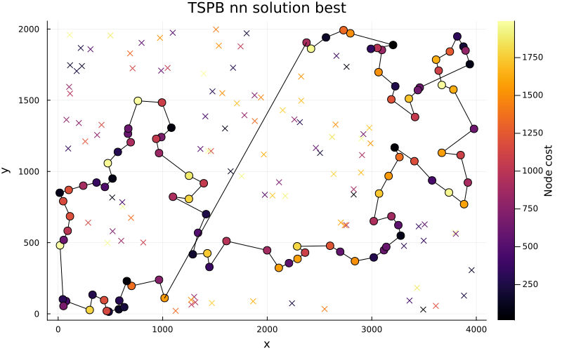|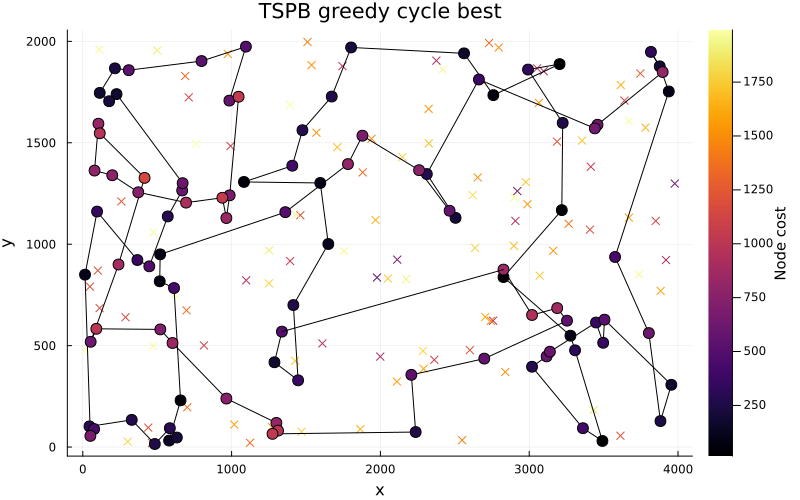|
| TSPC | 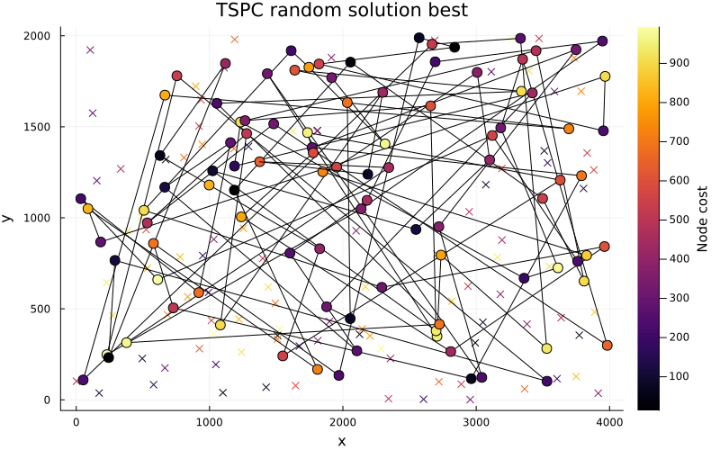|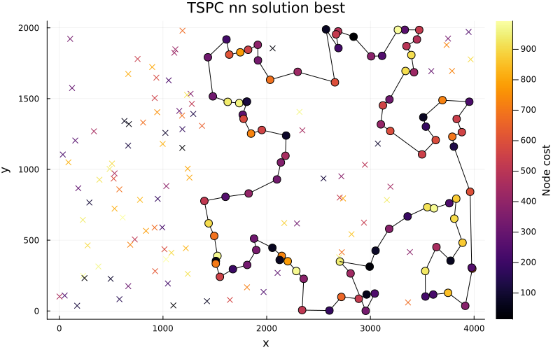|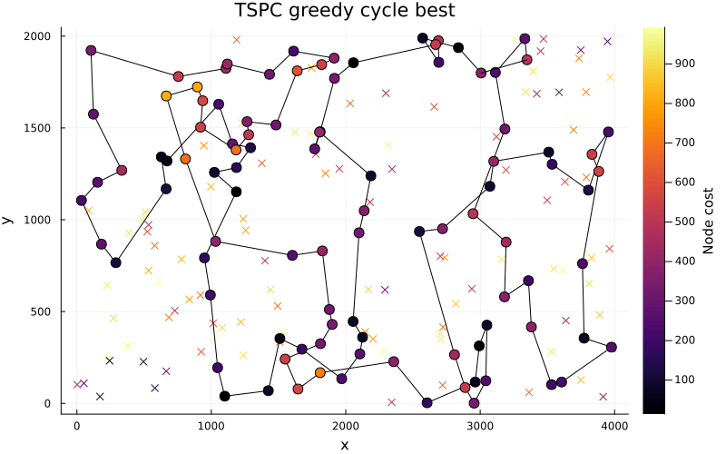|
| TSPD | 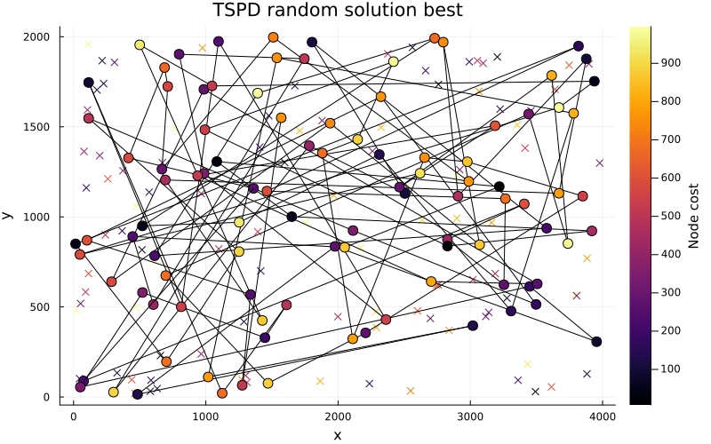||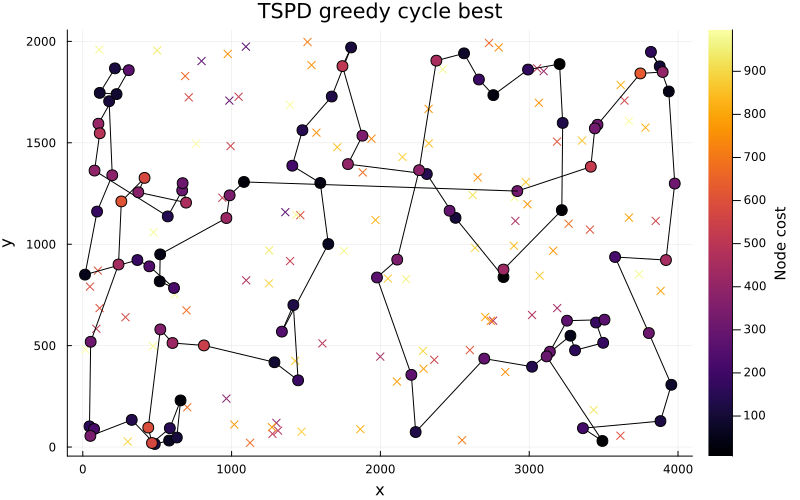|

### Results of a computational experiment
|Problem instance| Random solution | Nearest neighbor | Greedy cycle |
|----------------|-----------------|------------------|--------------|
| TSPA | 265387.13 (243653.0-287306.0) | 116516.55 (110035.0-125805.0)| 87679.14 (84471.0-95013.0) |
| TSPB | 266185.91 (243428.0-296041.0) | 116413.93 (109047.0-124759.0) | 79282.58 (77448.0-82631.0)|
| TSPC | 214612.4 (184254.0-238277.0) | 66329.95 (62629.0-71814.0)| 58872.68 (56304.0-63697.0)|
| TSPD | 218680.85 (194298.0-246766.0)| 67119.2 (62967.0-71396.0)| 54290.68 (50335.0-59846.0)|

*cell values: avg (min-max)*

## Conclusions:
As one may observe, the three greedy methods implemented take successively more factors into account - basically starting from nothing in the case of `Random` solution, through distances between subsequent points in `Nearest Neighbor` approach and `Greedy Cycle` using both distance and node cost. It is reflected in the results as well, as `Greedy Cycle` method provides the cost function of the smallest value, following by `Nearest Neighbor` and `Random`. 

It is visible that the blobs in the cycle solution are comparatively smaller, and so as the variance between their sizes. As for the `Nearest Neighbor`, as expected, for some cases one will end up with the last point placed far from the start and therefore the start-end node distance can make a solution suboptimal.   

## Source code:
https://github.com/azywot/evolutionary-computation